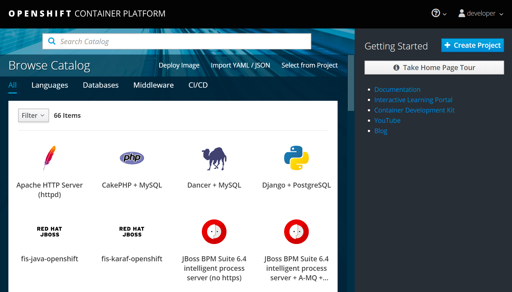
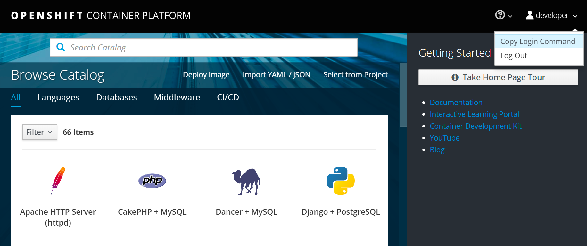
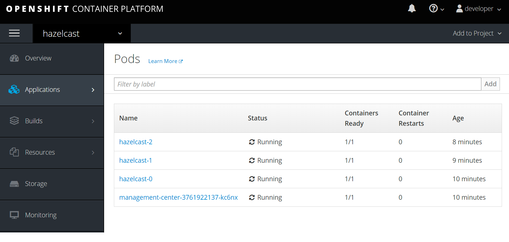
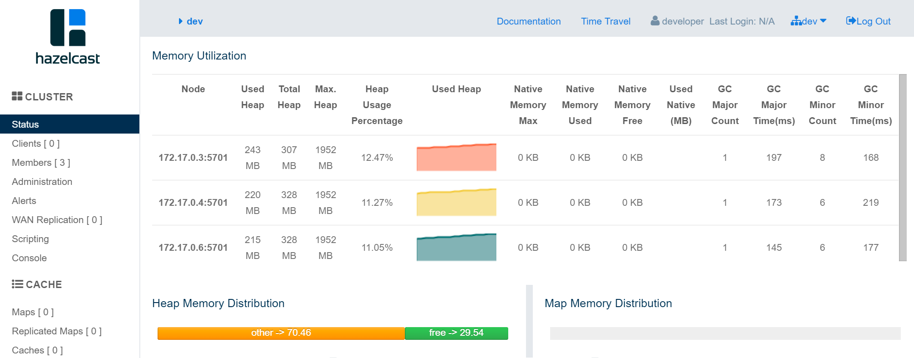
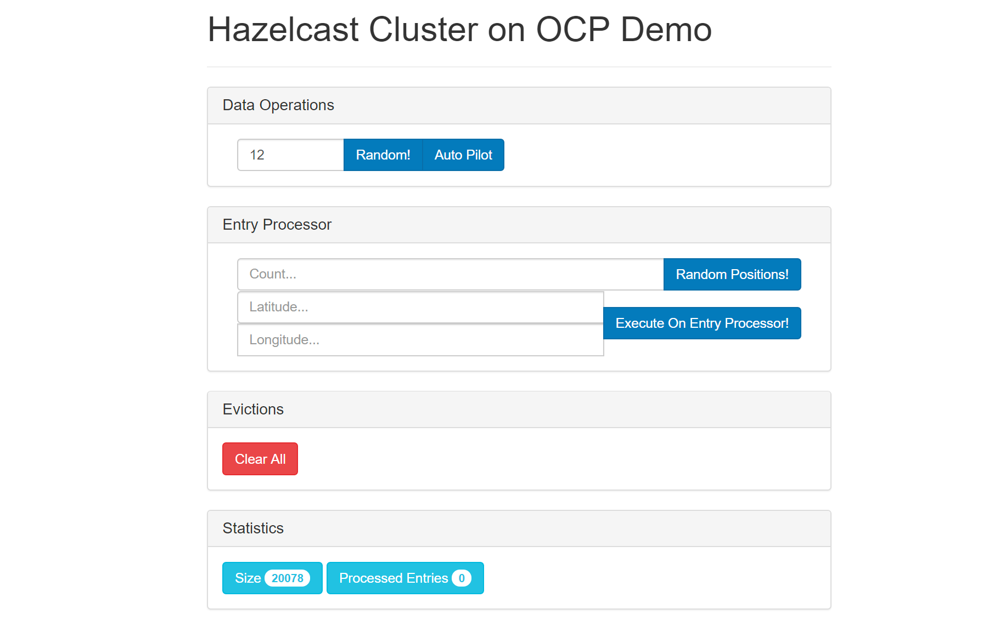
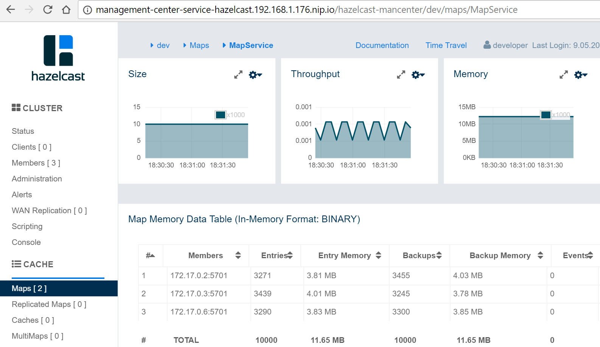

:github-address: https://github.com/hazelcast-guides/openshift
:templates-url: templates:ROOT:page$/
:hazelcast: Hazelcast IMDG
:framework: Kubernetes

= Hazelcast for OpenShift

Hazelcast can be used as a Caching Layer for applications deployed on https://www.openshift.com/[OpenShift].

This sample is a complete guideline on how to set up the local OpenShift environment, start Hazelcast cluster, configure Management Center, and finally run a sample client application.

include::{templates-url}/link-to-repo.adoc[]

== Step-by-step instruction

=== Step 1: Install OpenShift environment
There are multiple options to run the OpenShift environment:

- https://www.okd.io/minishift/[Minishift]: local OpenShift deployed on Virtual Machine
- https://www.openshift.com/products/online/[OpenShift Online]: Red Hat's cloud platform
- https://github.com/aws-quickstart/quickstart-redhat-openshift#red-hat-openshift-container-platform-on-the-aws-cloud[OpenShift installed on AWS]
- OpenShift installed on any other cloud platform or a dedicated server

[NOTE]
====
This guide can be followed on any environment, however some steps differ, for example, accessing Persistent Storage. What's more, some steps are not possible to execute on certain environments, for example, connecting with external client to the Hazelcast deployed on OpenShift Online (since it does not provide public IPs). In such cases, the Minishift solution is presented, because Minishift is free and simple to start from.
====

Minishift (version 3.11.0) is used to help with running OpenShift locally. Use the following steps to set it up:

1. Install OpenShift Container Development Kit (CDK) as described https://developers.redhat.com/products/cdk/download[here].
2. Configure CDK and run a first Hello World OpenShift application as described https://developers.redhat.com/products/cdk/hello-world[here].
The Red Hat guide is complete in general, however here are a few *hints* that can save your time:
- Complete the "Setup" section before you run `minishift setup-cdk`
- In case of any issues with Minishift, you can enable fine level logging with the option `--show-libmachine-logs -v5`
- In case of using Windows and Hyper-V:
* In one of the points you need to create the virtual switch, you can use https://docs.microsoft.com/en-us/windows-server/virtualization/hyper-v/get-started/create-a-virtual-switch-for-hyper-v-virtual-machines[this guide] to do it; then the name of the created
switch is the one you need to use instead of "External (Wireless)"
* Make sure to https://docs.microsoft.com/en-us/archive/blogs/virtual_pc_guy/adding-yourself-to-the-hyper-v-administrators-group-with-powershell[add user to Hyper-V Administrator group]
* Hyper-V does not well support NAT networks, so your router must accept the Virtual Machine connecting directly to the same
network interface (in case of problems, you may see a meaningless error `Too many retries waiting for SSH to be available`);
the solution is to use VirutalBox instead of Hyper-V or play with the https://docs.okd.io/3.11/minishift/using/experimental-features.html[experimental Minishift features]
3. Run `eval $(minishift oc-env)` and make sure your `minishift` and `oc` tools are installed and ready to use.

    minishift version
    minishift v1.27.0+5981f996
    CDK v3.7.0-1
    oc version
    oc v3.11.43
    kubernetes v1.11.0+d4cacc0
    features: Basic-Auth

4. Make also sure that you're able to access the OpenShift Web Console.

    minishift console

Log in as Username: "developer", Password: "developer".

=== Step 2: Start Hazelcast cluster

[NOTE]
====
In case of Hazelcast Enterprise, you will need a valid Hazelcast license key. If you don't have one, you can either
use https://github.com/hazelcast/hazelcast-code-samples/tree/master/hazelcast-integration/openshift/hazelcast-cluster/hazelcast[Hazelcast OpenShift Origin] instead or get a trial key from https://hazelcast.com/get-started/#hazelcast-imdg[this link].
====

==== 1) Create Project
Log into OpenShift Platform. The login command is available when you click in the Web Console: "Copy Login Command".

[source, shell]
----
oc login https://192.168.99.100:8443 --token=zCKv7Ot8wzoXpwmaTRgXl_9ZYO1guxuyygWiFYbBmz0
----

Then, you can create a new project.

[source, shell]
----
oc new-project hazelcast
----

[NOTE]
====
In case of https://github.com/hazelcast/hazelcast-code-samples/tree/master/hazelcast-integration/openshift/hazelcast-cluster/hazelcast-enterprise-rhel[Hazelcast Enterprise RHEL], you will need to authenticate to Red Hat Container Catalog as described
<<Authenticate to Red Hat Container Catalog, here>>.
====

==== 2) Start Hazelcast cluster
Change the directory to Hazelcast Enterprise (`cd hazelcast-cluster/hazelcast-enterprise`), Hazelcast Enterprise RHEL (`cd hazelcast-cluster/hazelcast-enterprise-rhel`) or Hazelcast (`cd hazelcast-cluster/hazelcast`).

Then, start the cluster with the following command.

[source, shell]
----
oc new-app -f hazelcast.yaml \
  -p NAMESPACE=$(oc project -q) \
  -p ENTERPRISE_LICENSE_KEY=<hazelcast_enterprise_license>
----

Used parameters:

- `NAMESPACE`: must be the same as the OpenShift project's name
- `ENTERPRISE_LICENSE_KEY`: Hazelcast Enterprise License (not needed for https://github.com/hazelcast/hazelcast-code-samples/tree/master/hazelcast-integration/openshift/hazelcast-cluster/hazelcast[Hazelcast
OpenShift Origin])

==== 3) Check that Hazelcast is running
To check all created OpenShift resources, use the following command. You might need to wait some time until all pods are in Running status.

[source, shell]
----
oc get all
NAME                                     READY   STATUS              RESTARTS   AGE
pod/hazelcast-0                          1/1     Running             0          3m
pod/hazelcast-1                          1/1     Running             0          37s
pod/hazelcast-2                          1/1     Running             0          3s
pod/management-center-556ccb8fdf-jhkpc   1/1     Running             0          3m

NAME                                TYPE        CLUSTER-IP   EXTERNAL-IP   PORT(S)    AGE
service/hazelcast-service           ClusterIP   None         <none>        5701/TCP   3m
service/management-center-service   ClusterIP   None         <none>        8080/TCP   3m

NAME                                DESIRED   CURRENT   UP-TO-DATE   AVAILABLE   AGE
deployment.apps/management-center   1         1         1            0           3m

NAME                                           DESIRED   CURRENT   READY   AGE
replicaset.apps/management-center-556ccb8fdf   1         1         0       3m

NAME                         DESIRED   CURRENT   AGE
statefulset.apps/hazelcast   3         3         3m
----

Please check that the STATUS is Running for all PODs. Then, to check the logs for each replica, use the following command:
[source, shell]
----
oc logs po/hazelcast-2
...
2021-04-28 13:32:20,174 [ INFO] [hz.wizardly_leavitt.IO.thread-in-1] [c.h.i.s.t.TcpServerConnection]: [172.17.0.12]:5701 [dev] [4.2] Initialized new cluster connection between /172.17.0.12:47658 and /172.17.0.10:5701
2021-04-28 13:32:20,183 [ INFO] [hz.wizardly_leavitt.IO.thread-in-0] [c.h.i.s.t.TcpServerConnection]: [172.17.0.12]:5701 [dev] [4.2] Initialized new cluster connection between /172.17.0.12:46709 and /172.17.0.11:5701
2021-04-28 13:32:26,178 [ INFO] [hz.wizardly_leavitt.generic-operation.thread-0] [c.h.i.c.ClusterService]: [172.17.0.12]:5701 [dev] [4.2]
Members {size:3, ver:3} [
	Member [172.17.0.10]:5701 - 73097260-75e7-4a52-820c-d8025dd12495
	Member [172.17.0.11]:5701 - a673ca49-3ece-44b9-9a0f-22f08b475a77
	Member [172.17.0.12]:5701 - 4471c176-9187-47cf-98fd-da42216f7fba this
]
2021-04-28 13:32:27,226 [ INFO] [main] [c.h.c.LifecycleService]: [172.17.0.12]:5701 [dev] [4.2] [172.17.0.12]:5701 is STARTED
...
----

[NOTE]
====
You can also perform all the operations and observe the results in the OpenShift Web Console.
====

=== Step 3: Access Management Center
Management Center application (Hazelcast Enterprise only) is already started together with Hazelcast members when using `hazelcast.yaml`. Nevertheless, in order to make it usable, you need to expose its service.
[source, shell]
----
oc expose svc/management-center-service
----
Then, it's accessible via the exposed route, which you can check by:
[source, shell]
----
oc get route
NAME                        HOST/PORT                                                   PATH   SERVICES                    PORT   TERMINATION   WILDCARD
management-center-service   management-center-service-hazelcast.192.168.99.100.nip.io          management-center-service   8080                 None
----

Then, you can access Management Center by opening `http://management-center-service-hazelcast.192.168.99.100.nip.io/hazelcast-mancenter` (`/mancenter` for versions prior to `3.10`) in your browser.

=== Step 4: Run a sample Hazelcast client application
If you're interested not only in setting up the Hazelcast cluster, but also in using it in the client application, you can follow the following guidelines.
Note that OpenShift Guide uses the https://www.eclipse.org/jkube/[Eclipse JKube] OpenShift Maven Plugin to build the container
image and deploy it into the
cluster. JKube requires 3.3.x or higher maven version, therefore make sure that you have proper maven version installed on your machine.

==== 1) Build Maven dependencies
In the main project directory run the following command to install the snapshot JAR files from the `ocp-demo-frontend` directory:

[source, shell]
----
mvn clean install
----

==== 2) Build "ocp-demo-frontend" Container image

Run the following command to build the container image in the cluster using S2I build strategy:
[source, shell]
----
mvn oc:build
----

==== 3) Check container image exists in the local OpenShift registry
Check if your image is already in the OpenShift registry:
[source, shell]
----
oc get is
NAME                IMAGE REPOSITORY                                                                       TAGS     UPDATED
ocp-demo-frontend   image-registry.openshift-image-registry.svc:5000/sbishyr-hazelcast/ocp-demo-frontend   latest   About a minute ago
----

==== 4) Deploy the "ocp-demo-frontend" application
To start the application, use the following command:
[source, shell]
----
mvn oc:resource oc:apply
----

You can check that the application is running correctly:
[source, shell]
----
oc get all -l app=ocp-demo-frontend
NAME                            READY   STATUS    RESTARTS   AGE
pod/ocp-demo-frontend-1-9n9n6   1/1     Running   0          97s

NAME                                        DESIRED   CURRENT   READY   AGE
replicationcontroller/ocp-demo-frontend-1   1         1         1       100s

NAME                        TYPE        CLUSTER-IP      EXTERNAL-IP   PORT(S)    AGE
service/ocp-demo-frontend   ClusterIP   172.30.118.44   <none>        8080/TCP   100s

NAME                                                   REVISION   DESIRED   CURRENT   TRIGGERED BY
deploymentconfig.apps.openshift.io/ocp-demo-frontend   1          1         1         config,image(ocp-demo-frontend:latest)

NAME                                                   TYPE     FROM     LATEST
buildconfig.build.openshift.io/ocp-demo-frontend-s2i   Source   Binary   1

NAME                                               TYPE     FROM     STATUS     STARTED         DURATION
build.build.openshift.io/ocp-demo-frontend-s2i-1   Source   Binary   Complete   3 minutes ago   39s

NAME                                               IMAGE REPOSITORY                                                                       TAGS     UPDATED
imagestream.image.openshift.io/ocp-demo-frontend   image-registry.openshift-image-registry.svc:5000/sbishyr-hazelcast/ocp-demo-frontend   latest   2 minutes ago

NAME                                         HOST/PORT                                                          PATH   SERVICES            PORT   TERMINATION   WILDCARD
route.route.openshift.io/ocp-demo-frontend   ocp-demo-frontend-sbishyr-hazelcast.apps.demo.ocp4.hazelcast.com          ocp-demo-frontend   8080                 None
----

==== 4) Check the application
JKube should have created a route for your application. You can check the route using the following command:

[source, shell]
----
oc get routes
NAME                                         HOST/PORT                                                          PATH   SERVICES            PORT   TERMINATION   WILDCARD
route.route.openshift.io/ocp-demo-frontend   ocp-demo-frontend-sbishyr-hazelcast.apps.demo.ocp4.hazelcast.com          ocp-demo-frontend   8080                 None
----

Now, if you open in the browser ocp-demo-frontend-sbishyr-hazelcast.apps.demo.ocp4.hazelcast.com, you should see the following home screen.

You can check that the application really works together with the Hazelcast cluster by doing some operation in the application, for example, entering "12" in the "Data Operations->Count" and clicking "Auto Pilot". Then, in the Management Center application, you should see that the entries are added.

=== Step 5: Clean up Hazelcast Deployment
==== Delete Hazelcast cluster

If you want to delete all resources (Replication Controller, Service, PODs, Storage, Config Map), you could use the following commands:

[source, shell]
----
oc delete all --all
oc delete pvc --all
oc delete configmap --all
----

== Authenticate to Red Hat Container Catalog
[NOTE]
====
Executing the following commands requires oc in version `3.9` or higher!
====
The `hazelcast-cluster/hazelcast-enterprise-openshift-rhel/hazelcast.yaml` uses images from https://access.redhat.com/containers/[Red Hat Container Catalog], which
requires setting Red Hat credentials. In order to do it, you need to execute the following command after creating the OpenShift project.
[source, shell]
----
oc create secret docker-registry rhcc \
   --docker-server=registry.connect.redhat.com \
   --docker-username=<red_hat_username> \
   --docker-password=<red_hat_password> \
   --docker-email=<red_hat_email>
oc secrets link default rhcc --for=pull
----

== External Hazelcast Client

Client application presented in this tutorial works only if deployed inside the OpenShift environment. If you need to connect to the Hazelcast cluster deployed on OpenShift, then you can expose a service as `LoadBalancer` or `NodePort` and connect to the cluster with Smart Routing disabled.

[NOTE]
====
Your OpenShift environment needs to provide public IP addresses, so for example, the solution won't work on the OpenShift Online environment.
====

To create a `LoadBalancer` service, create `service.yaml` file.

[source, yaml]
----
apiVersion: v1
kind: Service
metadata:
  name: hazelcast-loadbalancer
spec:
  type: LoadBalancer
  selector:
    app: hazelcast
    role: hazelcast
  ports:
  - protocol: TCP
    port: 5701
----
Then, apply it into your OpenShift cluster.
[source, shell]
----
oc apply -f service.yaml
----
The following command checks the external port under which the service is published.
[source, shell]
----
$ oc get service hazelcast-loadbalancer -o custom-columns=EXTERNAL_PORT:.spec.ports[0].nodePort
EXTERNAL_PORT
31296
----
Then, it's possible to access the Hazelcast cluster using server's public IP and that port. In case of Minishift, you can check its IP by:
[source, shell]
----
$ minishift ip
192.168.1.176
----
Finally, you can connect to the cluster with the following Java client code:

[source, java]
----
public class Client {
    public static void main(String[] args) throws Exception {
        ClientConfig clientConfig = new ClientConfig();
        clientConfig.getNetworkConfig().setSmartRouting(false);
        clientConfig.getNetworkConfig().addAddress("192.168.1.176:31296");
        HazelcastInstance client = HazelcastClient.newHazelcastClient(clientConfig);
        IMap map = client.getMap("test-map");
        map.put("testKey", "testValue");
        client.shutdown();
    }
}
----

== WAN Replication
You need to expose your Hazelcast cluster with the `LoadBalancer` (or `NodePort`) service as described in the section <<External Hazelcast Client>>.

Then, use the External IP in `target-endpoints` in the WAN Configuration. For example:
[source, xml]
----
<wan-replication name="wan-replication-cluster">
    <batch-publisher>
        <cluster-name>dev</cluster-name>
        <target-endpoints>EXTERNAL_IP:EXTERNAL_PORT</target-endpoints>
    </batch-publisher>
</wan-replication>
----
== Debugging

Debugging containerized applications in the OpenShift cluster can be difficult. In order to attach to the running POD, you can use the following command:

[source, shell]
----
oc exec -ti <pod_name> -- bash
----

== See Also
- xref:kubernetes:ROOT:index.adoc[Hazelcast for Kubernetes]
- xref:kubernetes-external-client:ROOT:index.adoc[External Hazelcast Client on Kubernetes]
